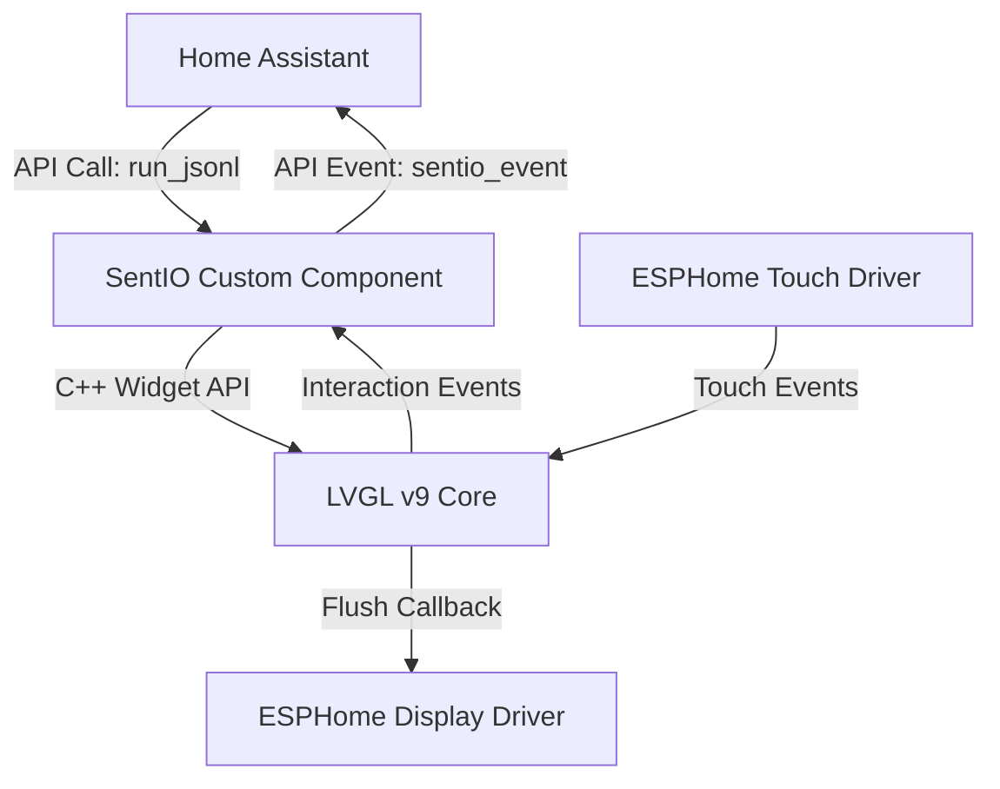

# SentIO: ESPHome Dynamic LVGL Overlay Component Plan

SentIO is a dynamic overlay component for ESPHome that controls LVGL v9 displays at runtime. By parsing JSONL (JSON Lines) layouts and commands sent via the ESPHome Native API (or loaded from local flash storage), it eliminates the need to compile and flash the ESPNode for every UI tweak. It acts as an event-driven HMI bridge, forwarding touch interactions to Home Assistant and executing layout updates on the fly.

---

## 📋 Project Overview
* **Project Type:** Embedded / ESPHome Custom C++ Component (`external_components`)
* **LVGL Version:** LVGL v9 (Standard ESPHome integration path)
* **Target Audience:** ESPHome developers seeking live UI customization, Home Assistant dashboard designers, and touch-panel applications.

---

## 🔍 Touchscreen & HMI Capabilities Comparison

| Feature | ESPHome Native Touchscreen | openHASP | **SentIO (Proposed Component)** |
|:---|:---|:---|:---|
| **Layout Loading** | Static (Compiled via YAML) | Dynamic (from Flash `/pages.jsonl`) | **Dynamic** (Flash `/pages.jsonl` + Native API stream) |
| **Runtime Updates** | Limited to pre-defined actions | Yes (via MQTT, Serial, Telnet) | **Yes** (via ESPHome Native API & User Services) |
| **WASM Designer** | No native tool | No native tool | **Planned companion app** (WASM render engine) |
| **Tap to Wake** | Requires complex YAML boilerplates (manually disabling all buttons or page changes) | Configurable backlight timer (sometimes wakes with accidental clicks) | **Dynamic overlay shield** (Pure LVGL C++ / Zero-latency / Touch event absorption) |
| **Backlight Dimming** | Requires complex `ledc` and `while` loop automations in YAML | Built-in backlight level commands | **Built-in Backlight Dimming Manager** (Hooks to existing `light` or `output` components with fading) |
| **Hardware Driver Control** | Native display and touch configurations (calibration, transforms, etc.) | Custom built-in drivers | **None (Leverages ESPHome)** (SentIO does not touch or configure any hardware drivers) |
| **Swipe Navigation** | Slide-detection logic must be calculated manually in lambdas | Native page swipes | **Native LVGL v9 Gesture Map** + HA Event propagation |
| **Swipe-Click Conflicts** | Swipes trigger button `on_press` actions if starting on them | Managed by complex user scripts | **Smart Click Binding** (Binds actions to `LV_EVENT_CLICKED`, preventing drag triggers) |

---

## 🛠️ Architecture & Design Decisions

### 1. ESPHome Coexistence (Non-Intrusive Overlay)
SentIO does **not** configure, rewrite, or interfere with ESPHome's display and touchscreen driver stack. It is a pure **GUI overlay** that runs on top of the native `lvgl` component. 
* ESPHome handles display buffer allocations, touch calibrations, driver communication, and loop flushing.
* SentIO registers a dependency on `lvgl` so that ESPHome sets up the display first.
* SentIO then hooks into the active screen (`lv_screen_active()`) to add, modify, and delete widgets at runtime.



### 2. The JSONL Parsing Engine
Instead of executing complex JSON structures which tax the ESP32's memory (RAM), SentIO parses the design line-by-line (`.jsonl`).
* **Creation Mode:** When an `obj` (widget type) is specified in the line:
  `{"id":"temp_val","obj":"label","x":100,"y":50,"text":"22°C"}`
  The engine instantiates the corresponding LVGL widget and inserts it into a `std::unordered_map<std::string, lv_obj_t*>` mapped by its string ID.
* **Update Mode:** When only an `id` and properties are passed:
  `{"id":"temp_val","text":"23.5°C"}`
  The engine retrieves the pointer from the map and dynamically updates the properties (text, styles, checked state) without redrawing the rest of the layout.
* **Style Engine:** Deep-parses style blocks (colors in `#HEX` format, margins, border radii, alignment, and paddings) using C++ wrappers.

### 3. Native API User Services
We will register four native user services under the ESPHome API:
1. `sentio_run_jsonl(line: string)`: Parses and executes a single JSON line to create, update, or delete a widget.
2. `sentio_clear()`: Wipes all widgets from the active screen and clears the widget pointer map.
3. `sentio_load_layout_file(filename: string)`: Reads a local layout file (e.g., `/pages.jsonl`) line-by-line from LittleFS and compiles the interface on boot.
4. `sentio_save_layout_line(line: string, append: boolean)`: Writes layout definitions to flash storage.

### 4. Power Management — Two Levels (CRITICAL DESIGN RULE)

SentIO is the **full owner** of GUI-level sleep. It is a **delegate only** for hardware-level deep sleep.

| Level | What it does | Owner |
|---|---|---|
| **GUI Sleep** (Soft) | Dims backlight, blocks touches, pauses LVGL animations | SentIO |
| **Deep Sleep** (HW) | CPU sleep, SPI bus float, display controller power-down | ESPHome `deep_sleep:` via user YAML |

#### GUI Sleep Detail
* **Standby Mode:** On `sleep_timeout`, dims the backlight via a linked `light::LightState` or `output::FloatOutput`. Simultaneously calls `lv_timer_pause_all()` to stop LVGL from burning CPU cycles rendering animations on a dark screen.
* **Burn-In Protection:** An optional `anti_burn_in: true` YAML key enables a low-priority LVGL timer that shifts the entire screen content by ±1-2 pixels every 60 seconds (OLED/LCD safe).
* **Transparent Shield Tap-to-Wake:** When dimmed, SentIO spawns a full-screen transparent `lv_obj` (`shield`) absorbing all touch events. The first tap wakes the screen and destroys the shield. No underlying buttons receive the event.
* **Animation Resume:** On wake, calls `lv_timer_resume_all()` and restores backlight.

#### Deep Sleep / Hardware Pre-Sleep Hook
* SentIO fires an `on_sleep` automation trigger **before** any hardware action. The user's YAML decides what happens (deep sleep, nothing, display power-off, etc).
* SentIO **never calls `esp_deep_sleep_start()` itself** — this is the user's responsibility.
* Optional `display_off_before_sleep: true` flag sends an LVGL screen-blank + `backlight=0` before firing `on_sleep`, ensuring the display does not glow during deep sleep on boards like the JC3248W535C where CS/DC pins float.

#### CST816 / Touch Chip Safety Gate
* If the upstream touch source has no `reset_pin` defined, SentIO forces **Soft Sleep only** — it stops consuming touch data but does NOT send I2C sleep commands to the chip. This avoids the "Sleep of Death" where chips like CST816 lock up and require a hardware RST to recover.

### 5. Swipe & Gestures Coexistence
* To support swipes without accidental button clicks, SentIO binds interactive actions (like button toggles or slider changes) to `LV_EVENT_CLICKED` (which only fires if the finger is released within the widget boundaries) rather than `LV_EVENT_PRESSED` (which fires instantly on touch).
* Swipes are tracked at the page level using LVGL's native `LV_EVENT_GESTURE` callback, firing `swipe_left`, `swipe_right`, etc., events directly back to Home Assistant.

---

## 📁 Proposed File Structure

```plaintext
SentIO/
├── external_components/
│   └── sentio/
│       ├── __init__.py           # Schema configuration and ESPHome code generator
│       ├── sentio.h              # SentIO Component class definition (CustomAPIDevice)
│       └── sentio.cpp            # JSONL parser, widget instantiator, and event handler
├── test_node.yaml                # Local ESPHome test configuration file
└── sentio-plan.md                # Implementation Plan (this file)
```

---

## 📝 Detailed Task Breakdown

### Phase 1: Foundation & Codegen Setup
```
[ ] Task 1.1: codegen_setup
    Create the python config schema in external_components/sentio/__init__.py.
    - Input: Schema options (sleep_timeout, backlight_id).
    - Output: ESPHome configuration validators and C++ bindings.
    - Verify: Run 'esphome config test_node.yaml' to ensure validation passes.
```

### Phase 2: Base C++ Component & Services
```
[ ] Task 2.1: base_cpp_setup
    Create sentio.h and sentio.cpp implementing the base Component class.
    - Input: C++ template class structure.
    - Output: Life-cycle method hooks (setup, loop, dump_config).
    - Verify: Verify code compiles against local mocks or standard headers.

[ ] Task 2.2: api_services_registration
    Register CustomAPIDevice user services for sentio_run_jsonl, sentio_clear, and sentio_load_layout_file.
    - Input: API registration methods.
    - Output: Callable services visible to ESPHome Native API.
    - Verify: Compile and inspect the code-generated main.cpp for register_service bindings.
```

### Phase 3: JSONL Parser & Widget Creator
```
[ ] Task 3.1: json_widget_factory
    Implement C++ parser using ArduinoJson to map string types to LVGL v9 creation functions.
    - Input: lvgl_port/main.cpp mapping algorithms.
    - Output: Factory creating obj, label, button, slider, switch, checkbox, dropdown, and textarea.
    - Verify: Test parsing code with sample json lines.

[ ] Task 3.2: style_application
    Implement style parsing for coordinate positioning, colors, borders, and margins.
    - Input: Style properties object map.
    - Output: Dynamic LVGL v9 style setting application.
    - Verify: Compile successfully and audit mappings against LVGL v9 style setter APIs.
```

### Phase 4: Event Routing & File Operations
```
[ ] Task 4.1: event_callback_router
    Set up LVGL event listeners on widgets to fire Home Assistant events.
    Ensure buttons are bound to LV_EVENT_CLICKED to avoid drag/swipe trigger conflicts.
    - Input: CustomAPIDevice fire_homeassistant_event.
    - Output: Event-driven feedback to Home Assistant.
    - Verify: Verify C++ callbacks pass the correct widget string ID and value states.

[ ] Task 4.2: flash_storage_layouts
    Add LittleFS read/write functions to stream JSONL layout definitions from storage.
    - Input: ESPHome filesystem APIs.
    - Output: Automatic startup page generator.
    - Verify: Verify filesystem include statements and file reading loops compile.
```

### Phase 5: Power Management & Tap-to-Wake
```
[ ] Task 5.1: sleep_wake_shield
    Implement the sleep dimming timer, backlight integration, and the transparent wake-up shield overlay in LVGL.
    - Input: Backlight component reference + transparent clickable overlay.
    - Output: Touch-decoupled tap-to-wake functionality.
    - Verify: Review C++ logic to ensure touch events are consumed by the shield when waking.

[ ] Task 5.2: animation_pause
    On sleep entry call lv_timer_pause_all(). On wake call lv_timer_resume_all().
    Add display_off_before_sleep flag (LVGL blank + backlight=0 before on_sleep trigger fires).
    - Verify: Confirm CPU usage drops during sleep by checking loop() timing.

[ ] Task 5.3: anti_burn_in
    Implement optional anti_burn_in YAML key. When true, register an lv_timer that shifts
    the active screen by ±1-2px every 60s using lv_obj_set_pos on the root container.
    - Verify: Logic audit — confirm shift is < 3px to avoid visible clipping.

[ ] Task 5.4: touch_chip_safety_gate
    In setup(), check if source touchscreen has a reset_pin. If null, set soft_sleep_only_ = true.
    When sleeping with soft_sleep_only_, skip I2C sleep commands. Only stop polling touch data.
    - Verify: Code review confirms no I2C writes occur in soft sleep path.
```

### Phase 6: Sensor Binding & Data Helpers
```
[ ] Task 6.1: sensor_label_bind
    Register sentio_bind_sensor(widget_id: string, sensor_id: string, format: string) service.
    Internally subscribes to the sensor state and auto-updates the LVGL label text on change.
    Supports printf-style format strings (e.g., "%.1f°C").
    - Verify: Confirm subscription callback fires and label updates without flicker.

[ ] Task 6.2: bg_image_service
    Register sentio_set_bg_image(widget_id: string, path: string) service.
    Loads image from LittleFS, calls lv_img_set_src, then lv_obj_invalidate on parent only.
    Avoids full-screen redraw flicker caused by naive background switching.
    - Verify: Confirm only the changed widget region is invalidated in LVGL.
```

### Phase 7: Page Lifecycle Events
```
[ ] Task 7.1: page_lifecycle_triggers
    When sentio_load_page(id) is called, fire on_hide for the previous page root widget
    and on_show for the new one. Expose as YAML automation triggers.
    - Verify: Confirm trigger order: on_hide fires before lv_scr_load, on_show fires after.

[ ] Task 7.2: is_page_condition
    Implement sentio.is_page YAML condition that returns true when the named page
    is the currently active LVGL screen. Allows conditional top_layer widget visibility.
    - Verify: Condition evaluates correctly after rapid page transitions.
```

### Phase 8: Extended Widgets (Post-MVP)
```
[ ] Task 8.1: lv_chart widget  (most requested by community)
[ ] Task 8.2: lv_colorwheel widget  (RGB light control)
[ ] Task 8.3: Encoder group mapping  (rotary encoder → widget group)
[ ] Task 8.4: Lottie animation support  (requires rlottie lib, low priority)
```

---

## 📁 Verification Checklist

> [!WARNING]
> DO NOT run `esphome compile` as the local test target environment does not support compilation verification. Use `esphome config` to test YAML integration, and compile locally using a standard compiler where appropriate.

- [ ] Schema validation runs successfully via `esphome config test_node.yaml`
- [ ] No purple/violet hex codes used in standard component definitions
- [ ] Transparent wake-up shield consumes event on wake-up trigger (logic audit passes)
- [ ] Mappings updated for LVGL v9 API differences (e.g. `lv_button_create` replacing `lv_btn_create`)
- [ ] All code conforms to `clean-code` and `powershell-windows` rules (no `&&` syntax in run lines)
